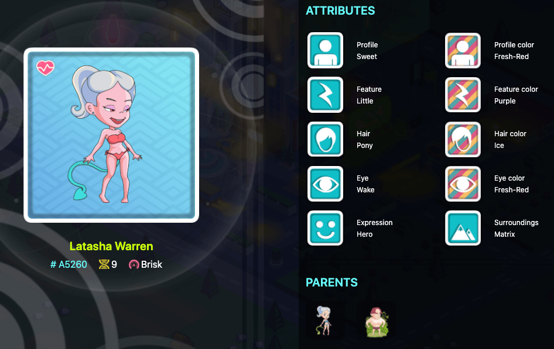

# Genome

Apostles have a unique physical appearance, talents. Traits are determined by inherited and mutated genome:

* Basic Info: Gender, Species
* Physical Appearance Genome
* Talent Genome

Appearance genome and talent genome don't interact with each other. Appearance genome decides how the Apostles look, and talent genome decides how each talent attribute is.

Below is a female human Apostle that resides on the Atlantis continent \(Ethereum\). She is at generation 9.

Below is a male alien Apostle that resides on the Byzantine continent \(Tron\). He is at generation 6.

## Traits

### Normal/Base Traits

This is a general term for standard traits that are found in Generation-0 Kitties.

### Hidden Genes

Hidden genes appear in the gene sequences of every Apostle, but only in hidden positions, and bear no influence on the Apostle's appearance. When apostles with hidden genes breed, there is a chance for a gene swap to occur which can cause the gene to move to the primary position and show up as visible trait in their offspring.

### Mutation Traits

Occasionally two traits can interact to create a mutation, a trait present in a newborn Apostle that does not appear in the genes of either parent. As they require breeding to generate, mutated genes can never appear in a Gen 0 Apostle.

Since mutations require specific breeding pairs and luck to manifest in the Apostles population, early generation Apostles with mutations are more scarce. Multiple generations are required to birth an Apostle that has purebred mutated genes. Mutated genes can also often pair together to create new mutated genes; the progression of mutations goes to Base genes, M1 genes, M2 genes, M3, genes, and one possible M4 gene from each trait category.

